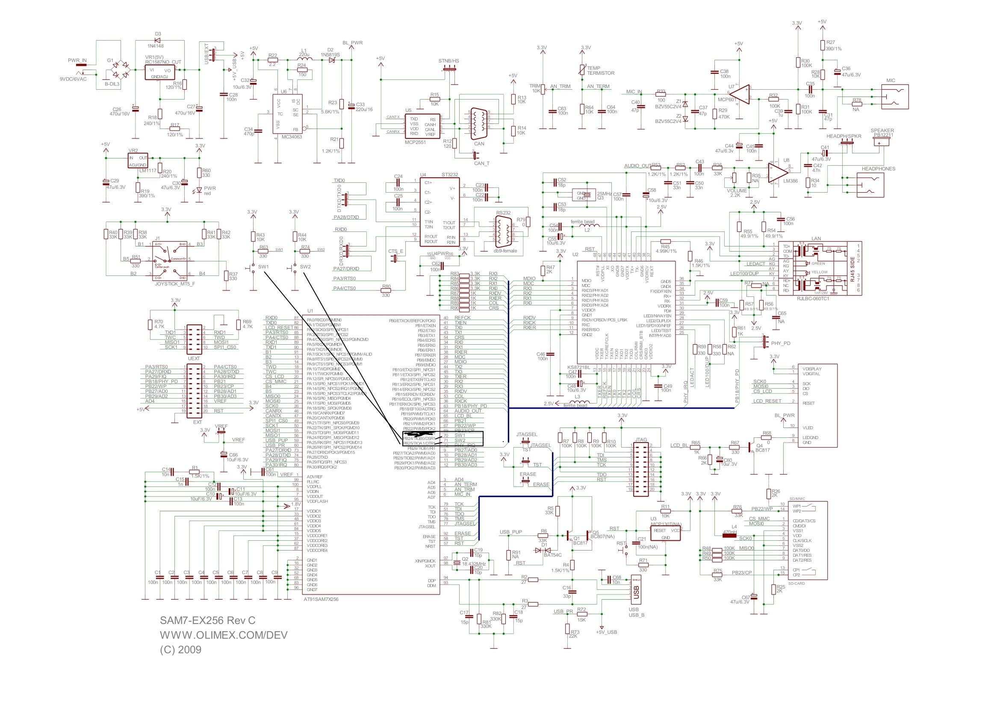

# PIO
Mikrokontroler AT81SAM7X256 posiada dwa kontrolery `PIO` (`PIOA` i `PIOB`). Zadaniem każdego z kontrolerów jest multipleksowanie zestawu wyprowadzeń urządzeń peryferyjnych. Każdy kontroler steruje 32 liniami. Każda linia może być przypisana do jednego z dwóch urządzeń peryferyjnych `A` lub `B`. Lub też działać jako uniwersalne wyjście/wejście.  
Wszystkie linie I/O (od `PA0` do `PA30` i `PB0` do `PB30`) zawierają programowalny rezystor podciągający. Ustawianie tego rezystora jest realizowane niezależnie dla każdej linii I/O poprzez kontroler PIO.  
Po zresetowaniu wszystkie linie I/O są automatycznie skonfigurowane jako wejścia z załączonym rezystorem podciągającym.  
  
Power Management Controller kontroluje zegar kontrolera `PIO` w celu oszczędzania energii. Konfiguracja linii I/O nie wymaga aby zegar kontrolera `PIO` był włączony ale jeżeli zegar jest wyłączony niektóre funkcje kontrolera `PIO` są wyłączone. **Odczytanie poziomu pinu wymaga aby zegar był włączony. Po resecie zegar `PIO` jest domyślnie wyłączony.** 

# Rejestry kontroli rezystora podciągającego
Rezystor podciągający może zostać załączony poprzez wpisanie wartości do rejestru `PIO_PUER` (Pull-up Enable Register) i wyłączony poprzez wpisanie wartości do `PIO_PUDR` (Pull-up Disable Resistor). Wpisanie wartości do tych rejestrów ustawia lub zeruje odpowiedni bit w `PIO_PUSR` (Pull-up Status Register). Wartość 1 w tym rejestrze oznacza że rezystor podciągający jest wyłączony, wartość 0 oznacza że jest załączony.

# Ustawienie funkcji pinu
Kiedy pin jest multipleksowany przez jedno albo dwa urządzenia peryferyjne, wybór odpowiedniego urządzenia jest kontrolowany przez rejestr `PIO_PER` (PIO Enable Register) i `PIO_PDR` (PIO Disable Register), które ustawiają wartość w rejestrze `PIO_PSR` (PIO Status Register). Wartość 0 odpowiedniego bitu w `PIO_PSR` oznacza że pin (odpowiadający temu bitowi) jest kontrolowany przez urządzenie peryferyjne. Wartość 1 oznacza że pin jest kontrolowany przez kontroler PIO. Jeżeli pin nie jest multipleksowany przez żadne urządzenie peryferyjne wpisywanie wartości do `PIO_PER` i `PIO_PDR` nie przynosi żadnego rezultatu, bit w `PIO_PSR` będzie zawsze ustawiony na 1. Po resecie, zazwyczaj linie I/O są kontrolowane przez kontroler PIO.

# Output Control
Kiedy linie I/O są kontrolowane przez kontroler PIO, mogą być one ustawione jako wyjście. Ustawienie linii jako wyjścia odbywa się poprzez rejestr `PIO_OER` (Output Enable Register), `PIO_ODR` służy do wyłączenia funkcji wyjścia na linii. Wartość 0 w `PIO_OSR` (Output Status Register) oznacza że odpowiednia linia może być wykorzystywana tylko jako wejście. Wartość 1 oznacza że linia pełni również rolę wyjścia. Stan linii która została skonfigurowana jako wyjście może zostać ustawiony poprzez rejestry `PIO_SODR` (Set Output Data Register) i `PIO_CODR` (Clear Output Data Register). Rejestry te modyfikują rejestr `PIO_ODSR` (Output Data Status Register).  
Do rejestru `PIO_ODSR` można bezpośrednio wpisywać wartość linii (umożliwia to między innymi negowanie stanu linii bez potrzeby wcześniejszego odczytu i sprawdzenia wartości linii) pod warunkiem że odpowiadający danej linii bit jest ustawiony w rejestrze `PIO_OWSR` (Output Write Status Register). Ustawienie tego bitu odbywa się poprzez rejestr `PIO_OWER` (Output Write Enable Register) a zerowanie poprzez `PIO_OWDR` (Output Write Disable Register). Po resecie wartość w rejestrze `PIO_OWSR` jest ustawiona na `0x0` (możliwość bezpośredniej modyfikacji `PIO_ODSR` jest wyłączona dla wszystkich linii).

# Inputs
Stan każdej linii I/O może zostać odczytany poprzez rejestr `PIO_PDSR` (Pin Data Status Register). Zawiera on stan danej linii niezależnie od jej konfiguracji. Aby odczytać wartość z tego rejestru, zegar kontrolera PIO musi zostać aktywowany (wpisanie wartosci do `PMC_PCER`).

# Rejestry - podsumowanie
**Tabela ze wszystkimi rejestrami PIO -> str. 227 w dokumentacji**
- konfiguracja zegara:
  - `PMC_PCER` - włączenie zegara dla odpowiedniego peryferium, bit 2 (PID2) zegar dla `PIOA`, bit 3 (PID3), zegar dla `PIOB`
  - `PMC_PCDR` - wyłączenie zegara dla odpowiedniego peryferium
  - `PMC_PCSR` - rejestr statusowy zawierający zegarów dla poszczególnych peryferiów
- załączenie kontroli nad wybranym pinem dla kontrolera PIO
  - `PIOx_PER` - włącz kontrolę
  - `PIOx_PDR` - wyłącz kontrolę
  - `PIOx_PSR` - rejestr statusowy, wartość 0 - PIO jest wyłączone dla odpowiedniego bitu, wartość 1 - PIO jest włączone dla odpowiedniego bitu
- konfiguracja linii jako wyjścia:
  - `PIOx_OER` - ustawienie linii jako wyjścia 
  - `PIOx_ODR` - ustawienie linii jako wejścia
  - `PIOx_OSR` - rejestr statusowy określający czy dana linia jest wejściem czy wyjściem, wartość 0 - linia jest wejściem, wartość 1 - linia jest wyjściem (i jeżeli dobrze rozumiem to jednocześnie jest też wejściem)
- ustawianie stanu linii:
  - `PIOx_SODR` - ustawienie stanu wysokiego na linii
  - `PIOx_CODR` - ustawienie stanu niskiego na linii
  - `PIOx_ODSR` - rejestr statusowy określający stan danej linii, wartość 0 - stan niski na linii, wartość 1 - stan wysoki na linii. Do tego rejestru (po skonfigurowaniu rejestru `PIO_OWSR`) można również bezpośrednio wpisywać wartości.
- konfiguracja możliwość bezpośredniego zapisu do rejestru `PIOx_ODSR`:
  - `PIOx_OWER` - ustawienie możliwości zapisu do `PIOx_ODSR` dla danej linii
  - `PIOx_OWDR` - wyłączenie możliwości zapisu do `PIOx_ODSR` dla danej linii
  - `PIOx_OWSR` - rejestr statusowy określający czy dla danej linii jest włączona możliwość bezpośredniego zapisu stanu dla rejestru `PIOx_ODSR`
- Odczyt stanu pin'u
  - `PIOx_PDSR` - rejestr statusowy, zawiera aktualny stan danej linii niezależnie od jej konfiguracji, wartość 0 - linia w stanie niskim, 1 - linia w stanie wysokim. **Aby odczytać stan linii z tego rejestru zegar PIO Controller musi być aktywny.**. W przeciwnym wypadku wartości w rejestrze `PIOx_PDSR` odpowiadając stanom linii w momencie gdy zegar został wyłączony.

# Konfiguracja
## Zadanie
Miganie ekranem LCD przy naciśnięciu przycisku SW1 i SW2

## Rozwiązanie


1. Numery pinów do których podłączone są przyciski SW1 i SW2 są zaznaczone na schemacie. SW1 - pin 70 (linia `PB24`), SW2 - pin 71 (linia `PB25`). LCD jest podłączone do pinu 65 (linia `PB20`). **Linie konfiguruje się według numeru linii a nie pinu**
2. Aby mieć możliwość konfiguracji linii jako wyjścia należy załączyć zegar dla `PIOB` -> `PMC_PCER = 1 << 3`, gdzie 3 to numer bitu `PIOB`, str. 30 w dokumentacji
3. Skonfigurowanie linii `PB24`, `PB25` i `PB20` jako linii I/O -> `PIOB_PER = 1 << 24 | 1 << 25 | 1 << 20` 
4. Do linii `PB24` i `PB25` podłączone są przyciski więc chcemy żeby te linie były skonfigurowane jako wejścia -> `PIOB_ODR = 1 << 24 | 1 << 25`. To chyba jest zbędne bo linie po resecie domyślnie są ustawione jako wejścia ale nie mam pewności więc lepiej to mimo wszystko ustawić ręcznie.
5. Do linii `PB20` podłączony jest LCD którego ekranem mamy migać więc `PB20` musi być skonfigurowany jako wyjście -> `PIOB_OER = 1 << 20`
6. **Koniec konfiguracji, teraz możemy nasłuchiwać w pętli naciśnięć przycisków**
7. Odczytanie wartości linii do których podłączone są przyciski odbywa się poprzez rejestr `PIOB_PDSR`. Naciśnięcie przycisku SW1 jest sygnalizowane stanem wysokim na bicie nr 24 w `PIOB_PDSR` a więc warunek `PIOB_PDSR & (1 << 24)` będzie `true` gdy przycisk zostanie naciśnięty. Analogicznie dla przycisku SW2.
8. Miganie wyświetlaczem może odbywać się poprzez:
   1. ustawianie bitu 20 na zmianę w rejestrach `PIOB_SODR` i `PIOB_CODR` -> `PIOB_SODR = 1 << 20` i `PIOB_CODR = 1 << 20`
   2. zezwolenie na bezpośredni zapis do rejestru `PIOB_ODSR` poprzez ustawienie bitu 20 w rejestrze `PIOB_OWER` a następnie negowanie bitu 20 w `PIOB_ODSR` -> `PIOB_OWER = 1 << 20; PIOB_ODSR ^= 1 << 20;` 

```c

void time_delay(int ms) { 
  volatile int aa,bb;
  for(aa=0;aa<=ms;aa++){
    for(bb=0;bb<=3000;bb++){
      __asm__("NOP");
    }
  }
}

// Funkcja uaktywniająca zegar kontrolera PIO
// params:
//      pio_pcer    1 - włączony, 2 - wyłączony
//      a_b         0 - PIOA, 1 - PIOB
void PIO_clock_enable(int pio_pcer, int a_b) {
  if(pio_pcer==1){
    PMC_PCER|=pio_pcer<<a_b+2;  // włączenie zegara na PIO, plus 2 bo wartość a_b jest z zakresu {0, 1} a bity odpowiadające PIOA i PIOB mają numery 2 i 3
  }
   
   if(pio_pcer==0){
     PMC_PCDR|=1<<a_b+2;
   }
}

// Funkcja załączająca kontrolę nad wybranym pinem dla kontorlera PIO (konfiguracja 
// pinu jako lini I/O)
// params:
//      line_no     numer linii która ma być ustawiona jako I/O
//      ena         1 - włącz kontrolę, 2 - wyłącz kontrolę
void PIO_enable(int line_no, int ena) {
  if (ena==1) {
    PIOB_PER = 1 << line_no;
  }
  if (ena==0) {
    PIOB_PDR = 1 << line_no;
  }
}

// Funkcja ustawiająca linię jako wejście lub wyjśccie
// params:
//      line_no     numer konfigurowanej linii 
//      ena         0 - linia jest wejściem, 1 - linia jest wyjściem 
void PIO_output_enable(int line_no, int ena) {
  if (ena==1) {
     PIOB_OER = 1 << line_no;
  }
  if (ena == 0) {
      PIOB_ODR = 1 << line_no;
  }
}

// Funkcja ustawiająca stan danej linii
// params:
//      line_no     numer konfigurowanej linii
//      ena         0 - stan niski na linii, 1 - stan wysoki na linii
void PIO_output_state(int line_no, int ena) {
  if (ena == 1) {
    PIOB_SODR = 1 << line_no;
  }
  if (ena == 0) {
    PIOB_CODR = 1 << line_no;
  }
}

// Funkcja negująca stan danej linii
// params:
//      line_no     numer negowanej linii
void PIO_output_negate(int line_no) {
  PIOB_OWER = 1 << line_no;     // ustawienie możliwości wpisywania wartości do rejestru PIOB_ODSR dla negowanej linii
  PIOB_ODSR ^= 1 << line_no;    // negacja linii bezpośrednio na rejestrze statusowym PIOB_ODSR
}

// Funkcja odczytująca stan przycisku
// params:
//      SW_no       numer przycisku, 1 - lewy przycisk, 2 - prawy przycisk     
unsigned int SW_read(unsigned int SW_no) {
  return PIOB_PDSR & (1 << 23 + SW_no); // plus 23 ponieważ przyciski podłączone są do linii 24 i 25
}

// Funkcja czekająca do mementu puszczenia przycisku
// params;
//      SW_no       numer przycisku na którego puszczenie czekamy
unsigned int SW_wait(int SW_no) {
  while (!SW_odczyt(SW_no)) {
    time_delay(10);
  }
}

int main(void) {
  PIO_clock_enable(1, 1);   // załączenie zegara na PIOB
  PIO_enable(20, 1);        // ustawienie linii 20, 24, 25 jako I/O.
  PIO_enable(24, 1);
  PIO_enable(25, 1);
  PIO_output_enable(20, 1); // pin 20 (LCD) jako wyjście, piny 24 i 25 (przyciski) jako wejście 
  PIO_output_enable(24, 0);
  PIO_output_enable(25, 0);

  while (1) {
    if (SW_read(1) == 0) {
      PIO_output_negate(20);
      SW_wait(1);
    }
    if (SW_read(2) == 0) {
      PIO_output_negate(20);
      SW_wait(2);
    }
  }
}

```