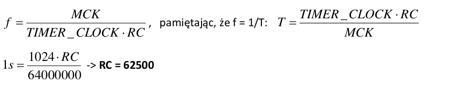

# PIT - Periodic Interval Timer
Timer `PIT` składa się z dwóch liczników, jeden 20 bitowy `CPIV` oraz jeden 12 bitowy `PICNT`. Częstotliwość inkrementacji obu liczników wynosi MCK/16:  
Jeżeli MCK = 32MHz, wartość `CPIV` będzie inkrementowana 2 miliony razy na sekundę (32MHz/16 = 2MHz). Licznik `CPIV` jest 20 bitowy więc może zliczyć wartości od 0 do (2^20) - 1 czyli 0 - 1048575. Licznik `CPIV` zlicza od 0 do zaprogramowanej przez użytkownika wartości pola `PIV` w rejestrze `PIT_MR`. Po doliczeniu do tej wartości następuje przepełnienie licznika `CPIV`. W momęcie przepełnienia licznik `CPIV` jest resetowany do 0 a wartość rejestru `PICNT` jest inkrementowana. Ponadto, jeżeli obsługa przerwań została włączona w rejestrze `PIT_MR` (bit `PITIEN`), ustawiany jest bit `PITS` w rejestrze `PIT_SR` sygnalizujący przerwanie.  

`PIT` może być włączony/wyłączony poprzez ustawienie flagi `PITEN` w rejestrze `PIT_MR` (domyślnie wyłączony). Ustawienie `PITEN` ma efekt tylko jeżeli wartość licznika `CPIV` jest równa 0. Po osiągnięciu przez `CPIV` wartości z rejestru `PIV` (compare match) `PITEN` jest resetowany i licznik przestaje liczyć. `PIT` rozpocznie liczenie ponownie tylko gdy `PITEN` zostanie ustawiony ponownie.  

Odczytanie wartości `CPIV` i `PICNT` poprzez rejestr `PIT_PIVR` powoduje zresetowanie wartości rejestru zliczającego licznika `PICNT` i wyzerowanie flagi `PITS` (sygnalizującej przerwanie). Odczytanie wartości `PIT` (licznika `CPIV` i sumatora `PICNT`) z rejestru `PIT_PIIR` nie powoduje zresetowania wartości licznika `PIT`.  

Przy założeniu że MCK = 32MHZ można obliczyć że najdłuższy możliwy okres zliczania licznika wynosi 0.524588s
```
MCK = 32MHz
MCK/16 = 32MHz/16 = 2MHz
max = 2^20 = 1_048_576 //pojemność licznika
T = max / 2MHz = 1_048_576 / 2_000_000 = 0.524588s
```

# Timer Counter 0
TC składa się z trzech identycznych 16 bitowych kanałów. Każdy z tych kanałów może być konfigurowany niezależnie i pracować w jednym z trybów - capture mode lub waveform mode. Ponadto TC0 może być inkrementowany z różnymi częstotliwościami pochodzącymi z wewnętrznego źródła taktowania mikroprocesora (MCK) bądź sygnału doprowadzonego do wybranych pinów mikrokontrolera (funkcja licznika). Precyzyjne odliczenie odcinka czasu wymaga zmiany domyślnego trybu przepełnienia na tryb porównania z wartością `RC`. Zmiana trybu na RC compare możliwa jest poprzez ustawienie bitu `CPCTRG` w rejestrze `TC0_CMR`. Wartość do porównania musi zostać wprowadzona do rejestru `TC0_RC`.  
Licznik `TC0` jest 16-bitowy co oznacza że maksymalna wartość możliwa do obliczenia to (2^16) - 1 = 65535.  
W trybie przepełnienia wartość rejestru `TC0_RC` nie ma znaczenia dla pracy licznika. Jego zawartość jest resetowana jedynie poprzez przekroczenie wartości maksymalnej. Przepełnienia są sygnalizowane poprzez ustawienie flagi `COFVS` w rejestrze `TC0_SR`. Odczytanie wartości licznika odbywa się poprzez rejestr `TC_CV`.  
W trybie RC compare licznik jest inkrementowany aż do osiągnięcia wartości równej tej wprowadzonej do rejestru `TC0_RC` co jest równoznaczne z resetowaniem wartości licznika. Doliczenie do wartości `RC` jest sygnalizowane przez ustawienie flagi `CPCS` w rejestrze `TC0_SR`.  
Do konfiguracji licznika służy rejestr `TC0_CMR` oraz `TC0_CCR`. 

# Rejestry - podsumowanie
**Tabela ze wszystkimi rejestrami PIT -> str. 77 w dokumentacji**
**Tabela ze wszystkimi rejestrami TC -> str. 389 w dokumentacji**

- `PIT_PIVR` (Periodic Interval Timer Value Register) - czytanie tego rejestru czyści `PITS` i `PIT_SR`
  - `CPIV` - obecna wartość licznika
  - `PICNT` - liczba okresów `CPIV` od czasu ostatniego odczytu `PIT_PIVR`.
- `PIT_MR` - Rejestr umożliwiający zdefiniowanie wartości do której będzie zliczał 20-bitowy licznik `CPIV`. 
  - `PIV` - 20 bitów do których można wpisać wartość do której będzie zliczał licznik `CPIV`
  - `PITEN` - Flaga za pomocą której można włączyć licznik `PIT`. Gdy wartość `CPIV` zrówna się z `PIV` flaga `PITEN` jest resetowana (`PIT` jest wyłączany).
  - `PITIEN` - Flaga umożliwiająca włączenie funkcji generacji przerwań przez `PIT`
- `PIT_SR` - Rejestr statusowy licznika `PIT`
  - `PITS` - wartość 0 - `PIT` nie doliczył do wartości `PIV` od czasu ostatniego odczytu rejestru `PIT_PIVR`. Wartość 1 - `PIT` doliczył od `PIV` od ostatniego odczytu rejestru `PIT_PIVR`.
- `PIT_PIVR` - Rejestr umożliwiający odczyt `CPIV` i `PICNT`. Czytanie z tego rejestru powoduje zresetowanie bitu `PITS` w `PIT_SR` i wartości `PICNT`
- `PIT_PIIR` - Rejestr umożliwiający odczyt `CPIV` i `PICNT` bez ich zerowania
- `TC_CCR` - Rejestr do włączania/wyłączania zegara timera `TC`
  - `CLKEN` - wartość 1 włącza zegar timera `TC`
  - `CLKDIS` - wartość 1 wyłącza zegar timera `TC`
- `TCx_CMR` - Rejestr konfiguracji capture mode timera `TC`
  - `TCCLKS` - wybór prescalera, wpisanie wartości od 0 do 4 wybiera kolejno dzielniki o wartościach: 2, 8, 32, 128, 1024
  - `CLKI` - wartość 0 - licznik jest inkrementowany przy krawędzi rosnącej zegara, wartość 1 - inkrementowany przy krawędzi opadającej
  - `CPCTRG` - wartość 0 - wystąpienie RC Compare nie ma efektu na licznika, wartość 1 - wystąpienie RC Compare powoduje reset licznika i wystartowanie zegara.
  - `WAVE` - wartość 0 - capture mode jest włączony, wartość 1 - waveform mode jest włączony
 - `TCx_CV` - rejestr przechowujący wartość timera `TCx`, służy do odczytu tej wartości.
 - `TCx_SR` - Rejestr statusowy timera `TCx`. **Odczyt tego rejestru powoduje jego wyzerowanie.**
   - `COVFS` - wartość 0 - przepełnienie nie nastąpiło od ostatniego odczytu `TCx_SR`. wartość 1 - przepełnienie nastąpiło od ostatniego odczytu `TCx_SR`
   - `CLKSTA` - wartość 0 - zegar jest wyłączony, wartość 1 - zegar jest włączony.
   - `CPCS` - wartość 0 - RC Compare nie wystąpiło od ostatniego odczytu `TCx_SR`, wartość 1 - RC Compare nastąpiło od ostatniego odczytu `TCx_SR`
- `TCx_IER` - rejestr w którym można uaktywnić przerwania od timera `TCx`
  - `COVFS` - wpisanie 1 uaktywnia przerwanie od przepełnienia
  - `CPCS` - wpisanie 1 uaktywnia przerwanie od RC Compare
- `TCx_IDR` - rejestr w którym można dezaktywować przerwania od timera `TCx`
  - `COVFS` - wpisanie 1 dezaktywuje przerwanie od przepełnienia
  - `CPCS` - wpisanie 1 dezaktywuje przerwanie od RC Compare
- `TCx_RC` - rejestr w którym ustawia się wartość do której ma zliczać licznik `TCx` w trybie RC Compare

# Konfiguracja

## Zadanie
uruchomienie timera w trybie przepełnienia, z częstotliwością inkrementacji licznika równą MCK/128. Kolejne przepełnienia licznika powodują zmianę stanu linii wyjściowej PB11. Niezbędną konfigurację linii wyjściowej I/O znacie Paostwo ze spotkania 1 oraz 2.

## Rozwiązanie
1. Konfiguracja linii `PB11` jako wyjścia wymaga załączenia zegara dla `PIOB`, ponadto licznik `TCO` również wymaga załączenia zegara -> `PMC_PCER = 1 << 3 | 1 << 12` gdzie bit nr 3 to zegar dla `PIOB` a 12 zegar dla `TC0`
2. Konfiguracja `PB11` jako linii I/O a następnie jako wyjścia -> `PIOB_PER = 1 << 11; PIOB_OER = 1 << 11;`
3. **Na czas konfiguracji licznika należy go wyłączyć** -> `TC0_CCR = 1 << 1` gdzie bit nr 1 to flaga `CLKDIS`. Ustawienie jej na 1 powoduje zatrzymanie inkrementacji licznika
4. Wyzerowanie flag w rejestrze statusowym licznika `TC0_SR`, rejestr ten jest zerowany przy każdym odczycie a więc wystarczy -> `TC0_SR;`
5. Ustawienie prescalera -> `TC0_CMR = 3`, wartość 3 odpowiada preskalerowi MCK/128. Rejestr `TC0_CMR` jest typu Read-write więc wpisanie do niego wartości 3 resetuje wszystkie pozostałe bit w tym rejestrze. Tym sposobem od razu ustawiamy flagę `WAVE` na 0, czyli tryb pracy licznika na RC compare ale równocześnie zerowana jest flaga `CPCTRG` -> RC Compare nie ma efektu na timer czyli timer działa w trybie overflow. Podsumowując żeby włączyć tryb overflow w timerze trzeba ustawić prescaler i wyzerować flagi `WAVE` i `CPCTRG`.
6. Po zakończeniu konfiguracji trzeba włączyć zegar timera który został wyłączony w punkcie 3 oraz zresetować timer -> `TC0_CCR = 1 << 0 | 1 << 2;`
7. **Koniec konfiguracji, teraz można nasłuchiwać w pętli przepełnień**
8. Jeżeli wystąpiło przepełnienie w rejestrze `TC0_SR` zostaje ustawiony bit `COVFS` a więc warunek -> `(TC0_SR & (1 << 0)) == 0` jest `true` w przypadku zaistnienia przepełnienia. **Odczyt TC0_SR powoduje jego zresetowanie**.
9. Negacja `PB11`

```c
int main() {

  PMC_PCER = 1 << 3 | 1 << 12;
  PIOB_PER = 1 << 11;
  PIOB_OER = 1 << 11;

  TC0_CCR = 1 << 1;
  TC0_SR;
  TC0_CMR = 3;
  TC0_CCR = 1 << 0 | 1 << 2;

  while (1) {
    if ((TC0_SR & (1 << 0)) != 0) {
      PIOB_OWER = 1 << 11;
      PIOB_ODSR ^= 1 << 11;
    }
  }

  return 0;
}
```

## Zadanie 
Uruchomienie timera w trybie RC Compare w celu odliczenia interwałów czasu równych 1 sekundę. Co 1 sekundę wyznaczaną przez kolejne setowania flagi porównania z RC (CPCS) następuje zmiana stanu linii wyjściowej PB11. Załozenie: MCK = 64 MHz. W pierwszej kolejności należy zwrócid uwagę, jaki jest wymagany dzielnik częstotliwości w celu osiągnięcia interwałów czasu równych 1 sekundzie.

## Rozwiązanie


1. Konfiguracja linii `PB11` jako wyjścia wymaga załączenia zegara dla `PIOB`, ponadto licznik `TCO` również wymaga załączenia zegara -> `PMC_PCER = 1 << 3 | 1 << 12` gdzie bit nr 3 to zegar dla `PIOB` a 12 zegar dla `TC0`
2. Konfiguracja `PB11` jako linii I/O a następnie jako wyjścia -> `PIOB_PER = 1 << 11; PIOB_OER = 1 << 11;`
3. **Na czas konfiguracji licznika należy go wyłączyć** -> `TC0_CCR = 1 << 1` gdzie bit nr 1 to flaga `CLKDIS`. Ustawienie jej na 1 powoduje zatrzymanie inkrementacji licznika
4. Wyzerowanie flag w rejestrze statusowym licznika `TC0_SR`, rejestr ten jest zerowany przy każdym odczycie a więc wystarczy -> `TC0_SR;`
5. Ustawienie prescalera i włączenie trybu RC Compare -> `TC0_CMR = 1 << 3 | 1 << 14`, ustawienie 1 na 3 bit czyli wybranie prescalera 1024, ponadto ustawiana jest flaga `CPCTRG` uaktywniająca tryb RC Compare. Wpisanie tych wartości powoduje wyzerowanie flagi `WAVE` a więc wybranie trybu RC Compare.
6. Wpisanie wartości do jakiej ma zliczać timer do rejestru `TC0_RC` -> `TC0_RC = 62500`
7. Po zakończeniu konfiguracji trzeba włączyć zegar timera który został wyłączony w punkcie 3 oraz zresetować timer -> `TC0_CCR = 1 << 0 | 1 << 2;`
8. **Koniec konfiguracji, teraz można nasłuchiwać w pętli przepełnień**
9. Jeżeli wystąpiło przepełnienie od RC Compare w rejestrze `TC0_SR` zostaje ustawiony bit `CPCS` a więc warunek -> `(TC0_SR & (1 << 4)) != 0` jest `true` w przypadku zaistnienia przepełnienia od RC Compare. **Odczyt TC0_SR powoduje jego zresetowanie**. 

```c

int main() {
  
  PMC_PCER = 1 << 3 | 1 << 12;
  PIOB_PER = 1 << 11;
  PIOB_OER = 1 << 11;

  TC0_CCR = 1 << 1;
  TC0_SR;
  TC0_CMR = 1 << 3 | 1 << 14;
  TC0_RC = 62500;
  TC0_CCR = 1 << 0 | 1 << 2;

  while(1) {
    if ((TC0_SR & 1 << 4) != 0) {
      PIOB_OWER = 1 << 11;
      PIOB_ODSR ^= 1 << 11;
    }
  }
  
  return 0;
}

```
# Konfiguracja PIT
Nie jestem tego pewien.

1. Odczyt rejestru `PIT_PIVR` aby wyzerować licznik `PIT`
2. Może odczyt `PIT_SR` żeby jego też wyzerować? o ile to tak działa
3. Wpisanie wartości do której ma zliczać `PIT` do rejestru `PIT_MR` (20 bitów `PIV`) -> `PIT_MR = 100000`
4. Uruchomienie `PIT` poprzez ustawienie flagi `PITEN` w `PIT_MR` -> `PIT_MR |= 1 << 24`

```c
PIT_PIVR;
PIT_SR;
PIT_MR = 100000 | 1 << 24;
```

# Przerwania

```c
// Funkcja uaktywniająca zegar kontrolera PIO
// params:
//      pio_pcer    1 - włączony, 2 - wyłączony
//      a_b         0 - PIOA, 1 - PIOB
void PIO_clock_enable(int pio_pcer, int a_b) {
  if(pio_pcer==1){
    PMC_PCER|=pio_pcer<<a_b+2;  // włączenie zegara na PIO, plus 2 bo wartość a_b jest z zakresu {0, 1} a bity odpowiadające PIOA i PIOB mają numery 2 i 3
  }
   
   if(pio_pcer==0){
     PMC_PCDR|=1<<a_b+2;
   }
}

// Funkcja załączająca kontrolę nad wybranym pinem dla kontorlera PIO
// params:
//      line_no     numer linii dla której kontrola PIO ma być włączona/wyłączona
//      ena         1 - włącz kontrolę, 2 - wyłącz kontrolę
void PIO_enable(int line_no, int ena) {
  if (ena==1) {
    PIOB_PER = 1 << line_no;
  }
  if (ena==0) {
    PIOB_PDR = 1 << line_no;
  }
}

// Funkcja ustawiająca linię jako wejście lub wyjśccie
// params:
//      line_no     numer konfigurowanej linii 
//      ena         0 - linia jest wejściem, 1 - linia jest wyjściem 
void PIO_output_enable(int line_no, int ena) {
  if (ena==1) {
     PIOB_OER = 1 << line_no;
  }
  if (ena == 0) {
      PIOB_ODR = 1 << line_no;
  }
}

void timer_przerw() {
  TC0_SR;
  PIO_output_negate(20);
}

void TC_config(int prescaler, int is_cmp, int rc) {
  TC0_CCR = 1 << 1; // wyłączenie inkrementacji licznika na czas konfiguracji (flaga CLKDIS)
  TC0_IDR = 0xFF;   // wyłączenie wszystich przerwań
  TC0_SR; // odczyt by zresetować flagi
  TC0_CMR |= prescaler | is_cmp << 14; // ustawienie preskalera i compare
  TC0_RC = rc;  // ustawienie wartości comapre
  TC0_CCR = 1 << 0 | 1 << 2; // wlaczenie zegara i reset (dlaga CLKEN)
}

int main(void) {
    PIO_clock_enable(1, 1); // włączenine zegara
    PIO_enable(20, 1);      // "przekazanie" kontroli nad pinami 20, 24, 25 do PIO controller
    PIO_output_enable(20, 1); // ustawienie linii 20 jako wyjścia

    PMC_PCER = PMC_PCER_PIOA | PMC_PCER_TC0; //ustawienie zegara systemowego dla TC0 i PIOA
    TC_config(4, 1, 9375);
    TC0_IER = 1 << 4; // ustawienie bitu CPCS - włączenie przerwań od RC Compare

    ctl_global_interrupts_disable();
    ctl_set_isr(12,1,CTL_ISR_TRIGGER_FIXED,timer_przerw,0);
    ctl_unmask_isr(12);
    ctl_global_interrupts_enable();
    while(1) {
    }
}

```

```c
int main (void){
    PMC_PCER = // ustawienie zegara systemowego dla peryferiom TC0 oraz PIOB (str. 30 datasheet)
    … // konfiguracja linii wyjsciowej (LAB1 – spotkanie 1 oraz 2)
    
    TC0_CCR = 1 << 1; // wyłączamy inkrementację licznika tak, by możliwa była jego konfiguracja
    TC0_SR; // pusty odczyt w celu wyzerowania ewentualnie ustawionych flag
    TC0_CMR = 3; // wybór częstotliwości inkrementacji licznika MCK/1024
    TC0_CCR = 1<<0 | 1<<2; // włączenie zegara timera oraz reset programowy (rejestr TC_CCR)
    while (1){
        if((TC0_SR & 1<<0) !=0 ) {
            // sprawdzenie czy na bicie 0 (COVFS) jest 1 – programowy odczyt
            powoduje reset wartości rejestru TC0_SR
            … // zmiana stanu linii wyjściowej (LAB1 – spotkanie 1 oraz 2)
        }
    } 
}
```

```c
int main (void){
    PMC_PCER = // ustawienie zegara systemowego dla peryferiom TC0 oraz PIOB (str. 30 datasheet)
    … // konfiguracja linii wyjściowej (LAB1 – spotkanie 1 oraz 2)
    
    TC0_CCR = 1 << 1; // wyłączamy inkrementację licznika tak, by możliwa była jego konfiguracja
    TC0_SR; // pusty odczyt w celu wyzerowania ewentualnie ustawionych flag
    TC0_CMR = 1<<3|1<<14; // wybór częstotliwości inkrementacji licznika MCK/1024 oraz bit CPCTRG
    TC0_RC = 62500; // wartośd RC obliczona powyżej
    TC0_CCR = 1<<0 | 1<<2; // włączenie zegara timera oraz reset programowy (rejestr TC_CCR)
    
    while (1){
        if((TC0_SR & 1<<4) !=0 ) {
        // sprawdzenie czy na bicie 4 (CPCS) jest 1 – programowy odczyt
        powoduje reset wartości rejestru TC0_SR
        … // zmiana stanu linii wyjściowej (LAB1 – spotkanie 1 oraz 2)
        } 
    } 
}
```