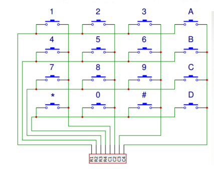

Klawiatura matrycowa podzielona jest na rzędy oraz kolumny. Na przecieciu rzędów i kolumn umieszczony jest przycik, ktory kiedy jest naciśnięty, zawiera daną kolumnę z rzędem. Aby wykryć naciśnięcie określonego przycisku, na dany rząd musimy podać stan niski. Jeśli któryś z przycisków przyporządkowanych wybranemu rzędkowi będzie naciśnięty, to stan odpowiedniej kolumnu zmieni się na niski. 
